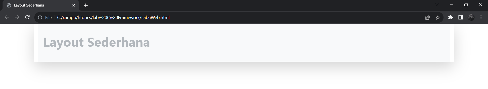
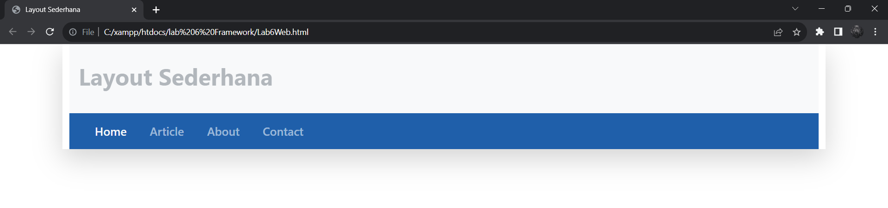
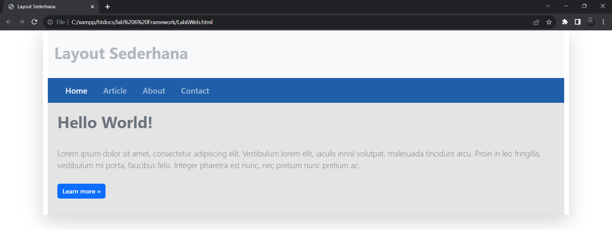
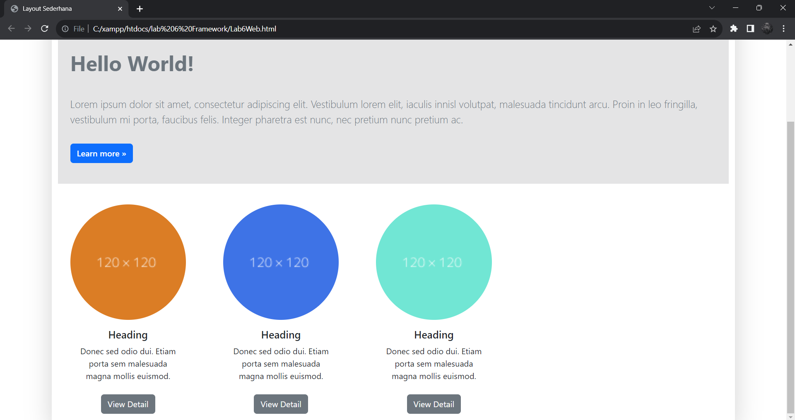
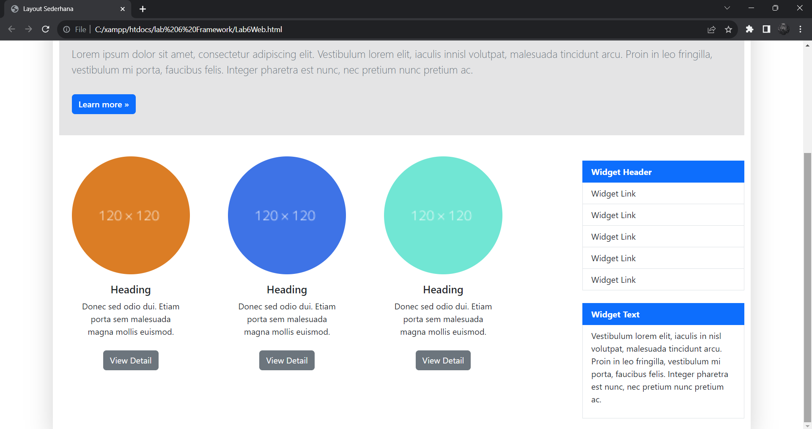
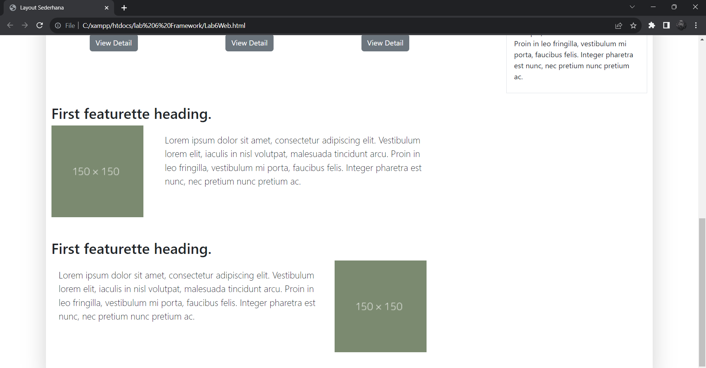
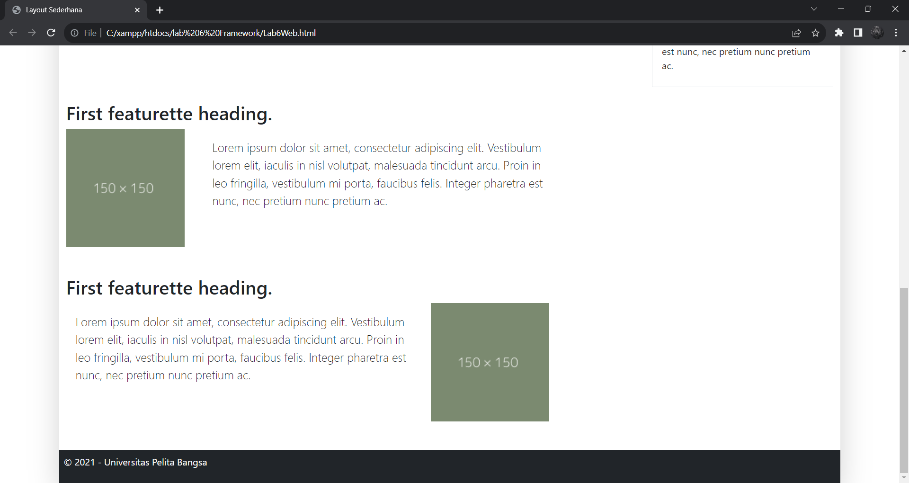
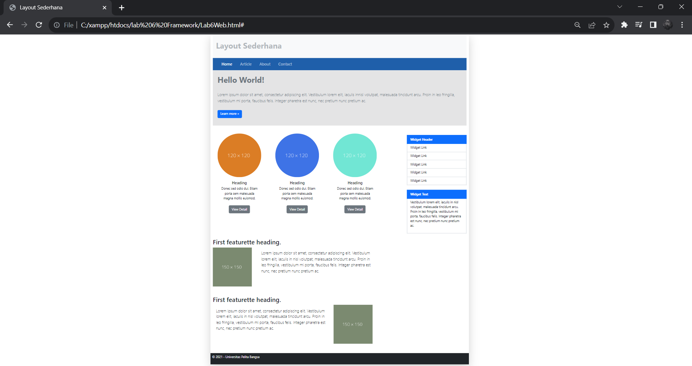

`Nama  : Faizah Via Fadhillah`

`Nim   : 312210460`

`Kelas : TI22.A4`

# Praktikum 6

## Twitter Boostrap

1. Membuat file Lab6Web.html

    Script :

    ```html
    <!doctype html>
    <html lang="en">
        <head>
            <!--Required Meta Tags-->
            <meta charset="utf-8">
            <meta name="viewport" content="width=device-width, initial-scale=1">
            
            <!--Bootstrap CSS-->
            <link href="https://cdn.jsdelivr.net/npm/bootstrap@5.3.2/dist/css/bootstrap.min.css" rel="stylesheet" integrity="sha384-T3c6CoIi6uLrA9TneNEoa7RxnatzjcDSCmG1MXxSR1GAsXEV/Dwwykc2MPK8M2HN" crossorigin="anonymous">
            <title>Layout Sederhana</title>
        </head>
        <body>
            <!--Bootstrap Bundle with Popper-->
            <script src="https://cdn.jsdelivr.net/npm/bootstrap@5.3.2/dist/js/bootstrap.bundle.min.js" integrity="sha384-C6RzsynM9kWDrMNeT87bh95OGNyZPhcTNXj1NW7RuBCsyN/o0jlpcV8Qyq46cDfL" crossorigin="anonymous"></script>
        </body>
    </html>
    ```


2. Membuat Container

    Script :

    ```html
        <body>
            <!--Container-->
            <div class="container shadow-lg">
                <!--Heading-->
                <div class="card-body bg-light p-3">
                    <h1 class="text-secondary py-3 text-opacity-50 fw-bold">Layout Sederhana</h1>
                </div>
                <!--Heading-->
            </div>
            <!--Container-->

            <!--Bootstrap Bundle with Popper-->
            <script src="https://cdn.jsdelivr.net/npm/bootstrap@5.3.2/dist/js/bootstrap.bundle.min.js" integrity="sha384-C6RzsynM9kWDrMNeT87bh95OGNyZPhcTNXj1NW7RuBCsyN/o0jlpcV8Qyq46cDfL" crossorigin="anonymous"></script>
        </body>
        ```

    Output :




3. Membuat Navbar

    Script :

    ```html
    <!--Navbar-->
    <nav class="navbar navbar-expand-lg navbar-dark" style="background-color: #1f5faa;">
        <div class="container-fluid">
        <button class="navbar-toggler" type="button" data-bs-toggle="collapse" data-bs-target="#navbarSupportedContent" aria-controls="navbarSupportedContent" aria-expanded="false" aria-label="Toggle navigation">
            <span class="navbar-toggler-icon"></span>
        </button>
        <div class="collapse navbar-collapse" id="navbarSupportedContent">
            <ul class="navbar-nav">
                <li class="nav-item active ms-4">
                    <a class="nav-link text-light fs-5 fw-semibold" aria-current="page" href="Lab6Web.html">Home</a>
                </li>
                <li class="nav-item ms-4">
                    <a class="nav-link fs-5 fw-semibold" href="#">Article</a>
                </li>
                <li class="nav-item ms-4">
                    <a class="nav-link fs-5 fw-semibold" href="#">About</a>
                </li>
                <li class="nav-item ms-4">
                    <a class="nav-link fs-5 fw-semibold" href="#">Contact</a>
                </li>
                </ul>
            </div>
        </div>
    </nav>
    <!--Navbar->
    ```

    Output :




4. Membuat Jumbotron

    Script :

    ```html
    <!--Jumbotron-->
    <div class="jumbotron p-2 text-secondary bg-opacity-25" style="background-color:#e4e4e5;">
        <h1 class="p-3 text-secondary fw-bold">Hello World!</h1>
        <p class="lead p-3 text-secondary">Lorem ipsum dolor sit amet, consectetur adipiscing elit. Vestibulum lorem elit, iaculis innisl volutpat, malesuada tincidunt arcu. Proin in leo fringilla, vestibulum mi porta, faucibus felis. Integer pharetra est nunc, nec pretium nunc pretium ac.</p>
        <a href="#" class="btn btn-primary mb-3 fw-semibold mx-3">Learn more &raquo;</a></p>
    </div>
    <!--Jumbotron-->
    ```

    Output :




5. Membuat Row dan Box

    Script :

    ```html
    <!--Row-->
    <div class="row">
        <!--Box-->
        <div class="col-md-9">
            <div class="row">
                <div class="col-3 mx-4">
                    <div class="col mt-4">
                        <div class="card pt-3" style="border: 0;">
                            
                            <div class="card-body">
                                <h5 class="card-title text-center">Heading</h5>
                                <p class="card-text text-center">Donec sed odio dui. Etiam porta sem malesuada magna mollis euismod.</p>
                                <p class="card-text text-center"><a href="#" class="btn btn-secondary mt-2">View Detail</a></p>
                            </div>
                        </div>
                    </div>
                </div>
                <div class="col-3 mx-4">
                    <div class="col mt-4">
                        <div class="card pt-3" style="border: 0;">
                            
                            <div class="card-body">
                                <h5 class="card-title text-center">Heading</h5>
                                <p class="card-text text-center">Donec sed odio dui. Etiam porta sem malesuada magna mollis euismod.</p>
                                <p class="card-text text-center"><a href="#" class="btn btn-secondary mt-2">View Detail</a></p>
                            </div>
                        </div>
                    </div>
                </div>
                <div class="col-3 mx-4">
                    <div class="col mt-4">
                        <div class="card pt-3" style="border: 0;">
                            
                            <div class="card-body">
                                <h5 class="card-title text-center">Heading</h5>
                                <p class="card-text text-center">Donec sed odio dui. Etiam porta sem malesuada magna mollis euismod.</p>
                                <p class="card-text text-center"><a href="#" class="btn btn-secondary mt-2">View Detail</a></p>
                            </div>
                        </div>
                    </div>
                </div>
            </div>
        </div>
        <!--Box-->
    </div>
    <!--Row--> 
    ```

    Output :




6. Membuat Widget

    Script :

    ```html
    <!--Widget-->
    <div class="col-md-3">
        <div class="my-3 mt-5">
            <div class="list-group" style="border-radius: 0;">
                <a href="#" class="list-group-item list-group-item-action active" aria-current="true" style="font-weight: bold;">Widget Header</a>
                <a href="#" class="list-group-item list-group-item-action">Widget Link</a>
                <a href="#" class="list-group-item list-group-item-action">Widget Link</a>
                <a href="#" class="list-group-item list-group-item-action">Widget Link</a>
                <a href="#" class="list-group-item list-group-item-action">Widget Link</a>
                <a href="#" class="list-group-item list-group-item-action">Widget Link</a>
            </div>
            <div class="list-group my-4" style="border-radius: 0; border: 1px">
                <a href="#" class="list-group-item list-group-item-action active " aria-current="true" style="font-weight: bold;">Widget Text</a>
                <a href="#" class="list-group-item list-group-item-action">
                    <p>Vestibulum lorem elit, iaculis in nisl volutpat, malesuada tincidunt arcu. Proin in leo fringilla, vestibulum mi porta, faucibus felis. Integer pharetra est nunc, nec pretium nunc pretium ac.</p>
                </a>
            </div>
        </div>
    </div>
    <!--Widget-->
    ```

    Output :




7. Membuat Divider

    Script :

    ```html
    <!--Divider-->
    <div>
        <!--Section 1-->
        <div class="mb-5" style="width: 900px; border: 0;">
            <h2>First featurette heading.</h2>
            <div class="row no-gutters">
                <div class="col-md-3">
                    
                </div>
                <div class="col-md-8">
                    <div class="card-body">
                        <p class="card-text lead p-3 fs-5">Lorem ipsum dolor sit amet, consectetur adipiscing elit. Vestibulum lorem elit, iaculis in nisl volutpat, malesuada tincidunt arcu. Proin in leo fringilla, vestibulum mi porta, faucibus felis. Integer pharetra est nunc, nec pretium nunc pretium ac.</p>
                    </div>
                </div>
            </div>
        </div>
        <!--Section 2-->
        <div class="mt-5 mb-5" style="width: 900px; border: 0;">
            <h2>First featurette heading.</h2>
            <div class="row">
                <div class="col-md-8">
                    <div class="card-body">
                        <p class="lead p-3 fs-5">Lorem ipsum dolor sit amet, consectetur adipiscing elit. Vestibulum lorem elit, iaculis in nisl volutpat, malesuada tincidunt arcu. Proin in leo fringilla, vestibulum mi porta, faucibus felis. Integer pharetra est nunc, nec pretium nunc pretium ac.</p>
                    </div>
                </div>
                <div class="col-md-3">
                    
                </div>
            </div>
        </div>
    </div>
    <!--Divider-->
    ```

    Output :




8. Membuat Footer

    Script :

    ```html
    <!--Footer-->
    <div class="card-footer text-start bg-dark text-light p-2">
        <p>&copy; 2021 - Universitas Pelita Bangsa</p>
    </div>
    <!--Footer-->
    ```

    Output :




## Hasil Akhir

